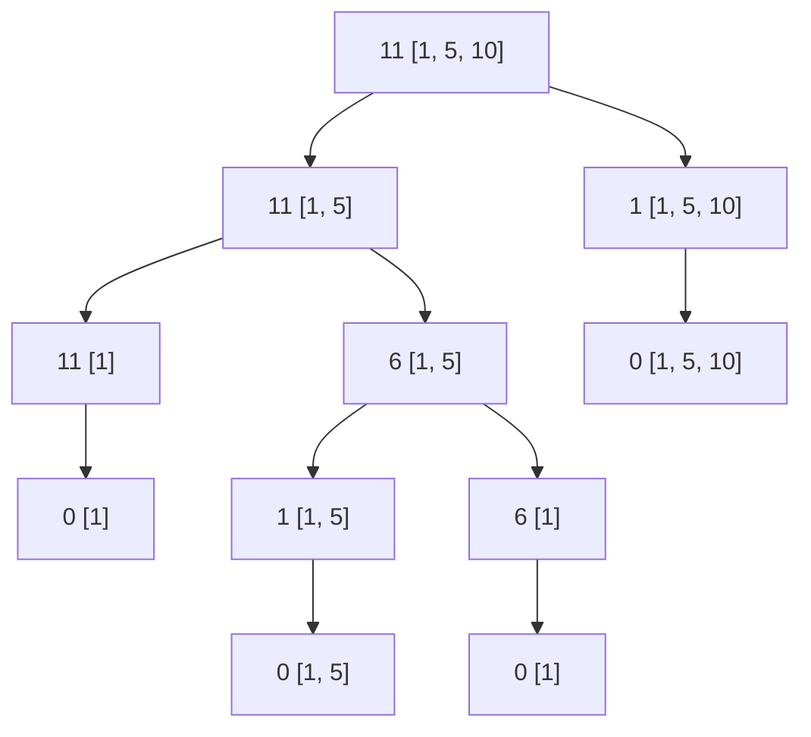

# Exercise 1.14

The tree generated by counting change for 11 cents is as follows, steps such as
decrementing by 1 and checking for each denomination when the amount is 1 are
omitted for clarity:

> remaining-change [denominations]

For analyzing the order of growth, it helps to understand the tree that the
process generates. Each node is divided into 2 cases, until a node hits a base
case (no denominations left, solution found or no solution found), we can
intuitively see that the nodes are duplicated at each level of the tree, and the
tree has depth roughly of $\frac{n}{k} = \theta(n)$, which shows that the
problem is duplicated about n times $\theta(2^n)$.

The memory order of growth is the same as the time growth, because each parent
needs to keep track of both branches of computation.
