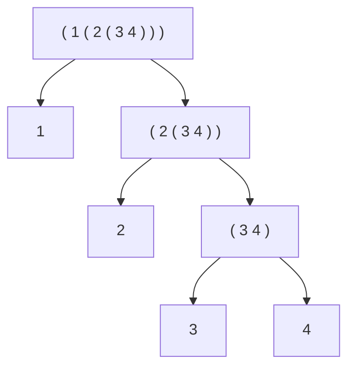

# Exercise 2.24

### Result

```scm
(list 1 (list 2 (list 3 4)))
;Value: (1 (2 (3 4)))
```

### Tree


```mermaid
graph TD
    L1["( 1 ( 2 ( 3 4 ) ) )"]
    L2["( 2 ( 3 4 ) )"]
    L3["( 3 4 )"]

    1
    2
    3
    4

    L1 --> 1
    L1 --> L2
    L2 --> 2
    L2 --> L3
    L3 --> 3
    L3 --> 4
```

### Box and Pointer

> Be happy with the tree
