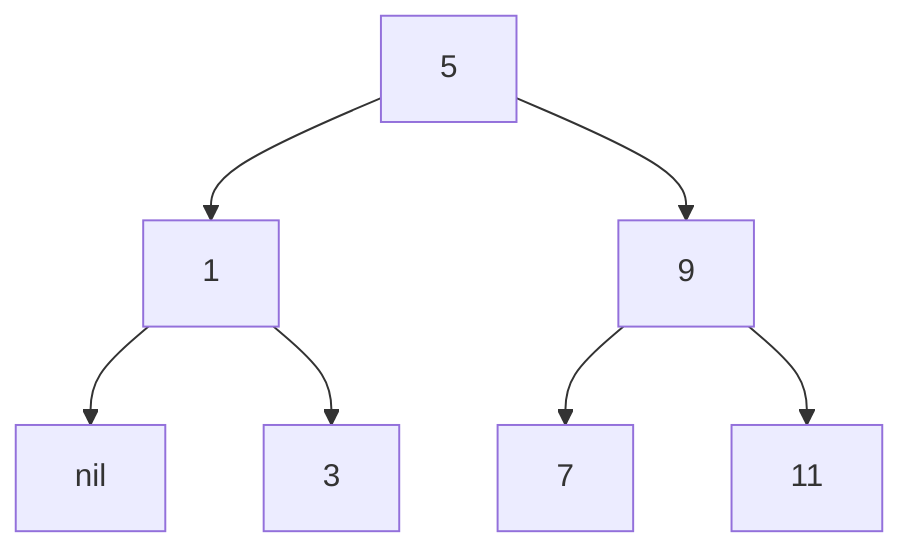

# Exercise 2.64

```scheme
(define (list->tree elements)
 (car (partial-tree elements (length elements))))

(define (partial-tree elts n)
 (if (= n 0)
  (cons '() elts)
  (let ((left-size (quotient (- n 1) 2)))
   (let ((left-result (partial-tree elts left-size)))
    (let ((left-tree (car left-result))
          (non-left-elts (cdr left-result))
          (right-size (- n (+ left-size 1))))
     (let ((this-entry (car non-left-elts))
           (right-result (partial-tree (cdr non-left-elts) right-size)))
      (let ((right-tree (car right-result))
            (remaining-elts (cdr right-result)))
       (cons (make-tree this-entry left-tree right-tree) remaining-elts))))))))
```

The procedure constructs the left tree with the first
$N_l = \lfloor \frac{N - 1}{2} \rfloor$ elements, until the base case of
$N = 0$, then it constructs the tree with the left tree already computed, the
entry as the first non-left-tree element, and the right tree as the first
$N_r = \lceil \frac{N - 1}{2} \rceil$ (as $N = 1 + N_l + N_r = 1 + \lfloor
\frac{N - 1}{2} \rfloor + \lceil \frac{N - 1}{2} \rceil $) elements from the
remaining elements. We can see that the left recursion builds the binary tree of
the elements less than the middle, and the right tree build the one with the
elements greater than the middle, this satisfais both the binary search tree
invariant, and the balance of the tree, as the right tree at most one element
more than the left one, and every element is included in the tree.

The procedure's growth order is $\theta(N)$, as each recursive call goes over
every other element than the middle and has a constant number of operations on
the middle.

Tree formed from `(1 3 5 7 9 11)`.


