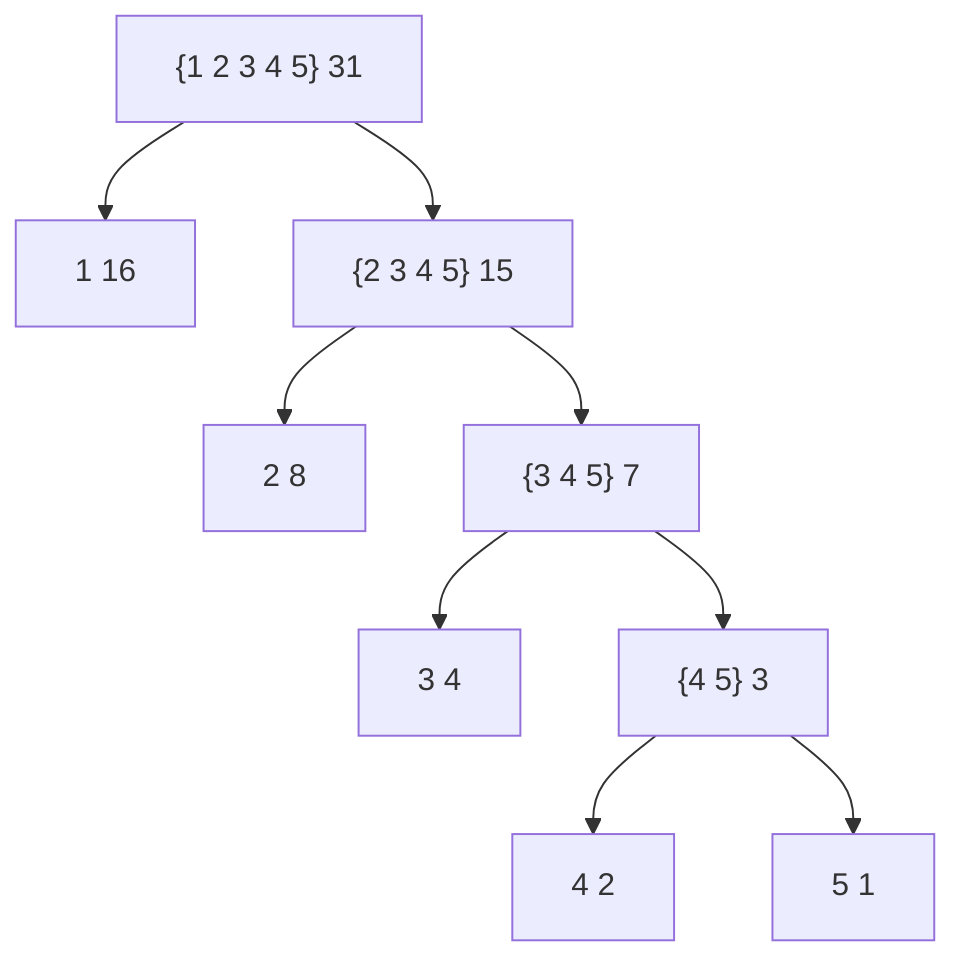
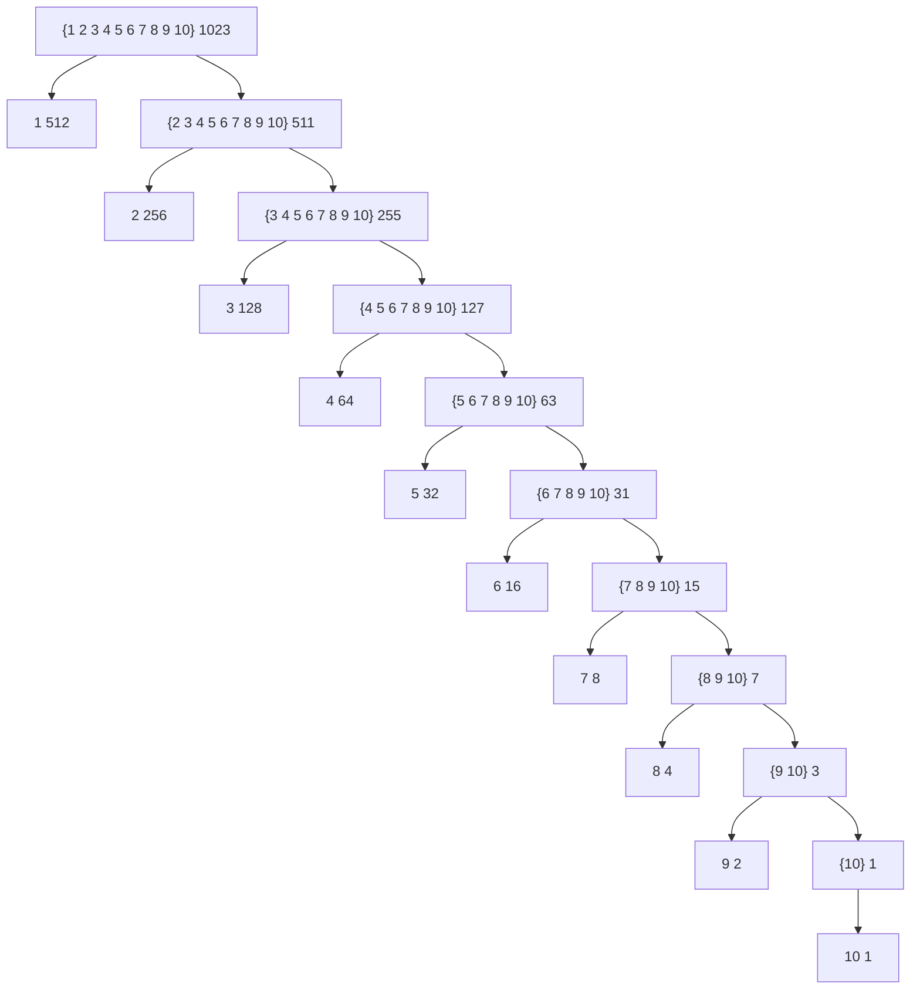

# Exercise 2.71

For any huffman encoding the most frequent symbol is always encoded with a
single bit, and for the mentioned kind of trees the least frequent symbol is
encoded with $n-1$ bits for codes of $n$ symbols.

Tree for $n = 5$.

Tree for $n = 10$.

